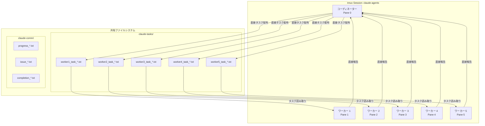
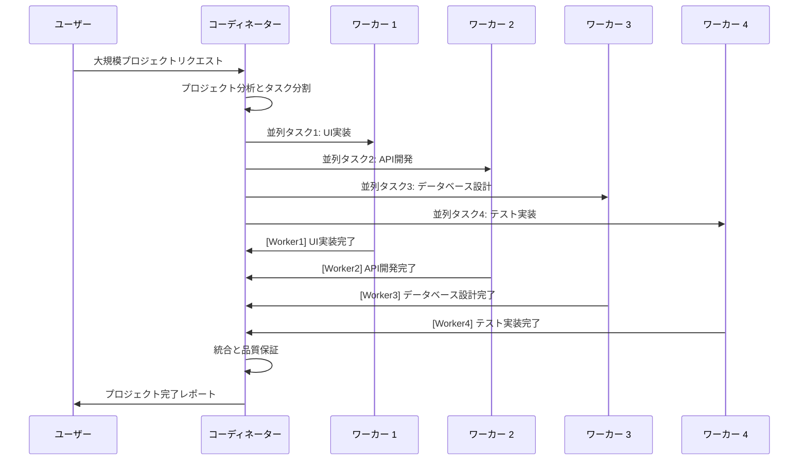

# YouAreTheCEO - コーディネーター主導型マルチエージェントシステム

**STILL IN BETA**
**ベータ版であり動作は保証しません**

YouAreTheCEOは、複雑なソフトウェア開発タスクの効率的な並列処理を可能にする、Claude Code用の**コーディネーター主導型**マルチエージェントシステムです。

## 概要

このシステムは、**コーディネーターが中心となってタスクを分析し、必要に応じて動的にワーカーチームを編成する**アーキテクチャを実装しています。最小構成から開始し、プロジェクトの複雑さに応じて柔軟にスケールする設計により、リソース効率と開発効率の両方を最大化します。

### 主要機能

- **コーディネーター主導**: 単一のコーディネーターがタスク分析・チーム構成・進捗管理を統括
- **動的チーム編成**: 最小構成から開始し、必要に応じてリアルタイムでワーカーを追加
- **フラットな組織構造**: 階層を排除したシンプルなコミュニケーション設計
- **リソース効率**: 過剰なエージェント起動を避け、必要最小限のリソースで開始
- **リアルタイムコミュニケーション**: tmuxベースのエージェント間インスタントメッセージング
- **トークン管理**: インテリジェントなコンテキストクリアと使用量監視

## 🚀 完全自動化ワークフロー

### 📋 概要：わずか2ステップで完了

1. **コマンド1つでセットアップ** → Claude 4 Opusコーディネーターが自動起動
2. **プロジェクト要件を説明** → コーディネーターが全てを自動実行

### ⚡ ステップ1: ワンコマンドセットアップ

```bash
cd /path/to/your/project
./YouAreTheCEO/scripts/smart-setup.sh
```

**自動実行される内容:**
- ✅ tmuxマルチペイン環境構築
- ✅ Claude 4 Opusコーディネーター起動  
- ✅ claude-coordinator.md指示書自動読み込み
- ✅ プロジェクト分析・実行準備完了

### 💬 ステップ2: プロジェクト要件を説明

セットアップ完了後、コーディネーターに要件を自然言語で説明するだけ：

```
例: "ユーザー認証機能付きのTodoアプリを作りたい。
    React + Node.js + PostgreSQLで、JWT認証を実装してください。"
```

### 🤖 自動実行される完全ワークフロー

コーディネーターが以下を**完全自動**で実行：

#### 🧠 Phase 1: インテリジェント分析
- 📊 技術要件の詳細分析
- 🎯 アーキテクチャ設計
- 👥 最適チーム規模の決定（1-10ワーカー）
- 📝 並列実行可能なタスクへの分割

#### ⚙️ Phase 2: 動的チーム編成
- 🚀 必要数のClaude 4 Sonnetワーカー自動スポーン
- 🎭 専門役割の自動割り当て（フロント/バック/DB/テスト等）
- 📋 各ワーカーへの詳細タスク配布

#### 🔄 Phase 3: 並列実行・監視
- ⚡ 複数ワーカーでの同時開発
- 📈 リアルタイム進捗監視
- 🔧 動的リソース調整
- 🛡️ 品質管理・エラー対応

#### 🎯 Phase 4: 統合・完成
- 🔗 全コンポーネントの自動統合
- ✅ 包括的テスト実行
- 📄 完成報告とドキュメント生成

### 🎮 実際の使用例

```bash
# 1. セットアップ
./YouAreTheCEO/scripts/smart-setup.sh

# 2. コーディネーターと会話（セットアップ後に自動でtmuxセッションに入る）
"ECサイトのショッピングカート機能を実装したい。
 React + Express + MongoDB構成で、Stripe決済も組み込んでください。"

# 3. あとは全自動！
#   → コーディネーターが6ワーカーが最適と判断
#   → Worker1: React UI開発
#   → Worker2: Express API開発  
#   → Worker3: MongoDB設計
#   → Worker4: Stripe決済統合
#   → Worker5: テスト実装
#   → Worker6: デプロイ設定
#   → 全ワーカーが並列実行、コーディネーターが統制
```

### 📊 オプション: 手動監視・操作

```bash
# 進捗確認（リアルタイム）
./YouAreTheCEO/scripts/check-status.sh

# 結果収集
./YouAreTheCEO/scripts/collect-results.sh --output results.md

# 全ペインクリア
./YouAreTheCEO/scripts/parallel-clear.sh
```

## モデル設定

システムは、役割に最適化された異なるClaudeモデルを使用します：

- **コーディネーター**: Claude 4 Opus（戦略的思考、アーキテクチャの決定、統合）
- **ワーカー**: Claude 4 Sonnet（実装、コーディング、実行）

この設定により、戦略的監督と効率的な実行のバランスを取ります。

## ディレクトリ構造

```
PROJECT_DIR/                    ← プロジェクトルート
├── your-project-files/         ← 実際のプロジェクトコード  
└── YouAreTheCEO/               ← コーディネーター主導型システム
    ├── scripts/               ← 実行スクリプト
    │   ├── smart-setup.sh     ← コーディネーター主導型セットアップ
    │   ├── start-all-claude.sh ← Claudeインスタンス開始
    │   ├── add-workers.sh     ← 動的ワーカー追加
    │   ├── assign-task.sh     ← タスク配布
    │   ├── check-status.sh    ← 進捗監視
    │   ├── collect-results.sh ← 結果集約
    │   └── parallel-clear.sh  ← 全ペイン同時クリア
    ├── claude-tasks/          ← タスクファイル（自動生成）
    │   ├── worker1_task_*.txt
    │   ├── worker2_task_*.txt
    │   └── ...
    ├── claude-comm/           ← コミュニケーションファイル（自動生成）
    │   ├── progress_*.txt
    │   ├── issue_*.txt
    │   └── completion_*.txt
    ├── claude-coordinator.md  ← コーディネーター指示書
    ├── claude-worker.md       ← ワーカー指示書
    └── .pane_ids             ← tmuxペーン追跡
```

## コーディネーター主導型ワークフロー

### フェーズ1: コーディネーター分析フェーズ

1. **タスク受領**: 人間からコーディネーターが直接タスクを受け取り
2. **複雑性分析**: コーディネーターが技術的複雑さと要件を独自に分析
3. **チーム規模決定**: 分析結果に基づき必要なワーカー数を自律的に決定
4. **アーキテクチャ設計**: 全体的なソリューション設計とタスク分割

### フェーズ2: 動的チーム編成

```bash
# コーディネーターの判断に基づきワーカーを追加
./YouAreTheCEO/scripts/add-workers.sh [コーディネーターが決定した数]
```

**コーディネーターによる複雑さ判定基準:**
- **小規模（1-2ワーカー）**: 単一機能、バグ修正、シンプルなタスク
- **中規模（3-4ワーカー）**: 複数機能、API開発、UI更新
- **大規模（5-6ワーカー）**: アーキテクチャ変更、システム統合
- **特大規模（7-10ワーカー）**: 完全システム再設計、大規模移行

### フェーズ3: コーディネーター指導による並列実行

1. **戦略的タスク分割**: コーディネーターが専門性を考慮した最適なタスク配布
2. **並列処理統制**: ワーカーが独立作業を行いながらコーディネーターが全体管理
3. **リアルタイム進捗管理**: ワーカーからの直接報告によるプロジェクト可視化
4. **動的リソース調整**: 進捗に応じてワーカー追加・タスク再配分

### フェーズ4: コーディネーター主導統合

1. **統合戦略実行**: コーディネーターの設計に基づく成果物統合
2. **品質保証統制**: コーディネーターによる統一的な品質管理
3. **最終アーキテクチャ検証**: 全体設計との整合性確認

## コミュニケーションパターン

### ワーカーからコーディネーターへの報告

すべてのワーカーは報告に以下の標準形式を使用します：

```bash
tmux send-keys -t $COORDINATOR_PANE '[WorkerID] Status: Description' Enter
```

**例:**
```bash
# 成功
'[Worker1] Completed: API実装完了'

# 進捗
'[Worker2] Progress: 75%完了 - UIコンポーネント準備完了'

# 問題
'[Worker3] Issue: データベース接続エラー - 支援が必要'

# 質問
'[Worker4] Question: TypeScript strictモードを使用すべきですか？'
```

### コーディネーター指示

コーディネーターは明確で実行可能な指示を提供します：
```bash
# タスク割り当て
"Worker1: JWTトークンとパスワードハッシュ化を使用したユーザー認証を実装"

# エラー処理
"Worker2: データベースエラーが発生した場合は、詳細とともに即座に報告"

# 協力
"Worker3: フロントエンド統合のためにAPIスキーマをWorker4と共有"
```

## System Architecture

### フラットマルチエージェント構造



### コミュニケーションフロー



## ベストプラクティス

### コーディネーター向け

1. **控えめなスタート**: 少ないワーカーから始め、必要に応じてスケールアップ
2. **明確な指示**: 具体的で実行可能なタスクを提供
3. **定期チェック**: 進捗を頻繁に監視
4. **独立タスク**: ワーカー間の依存関係を最小化
5. **品質ゲート**: 統合のためのチェックポイントを実装

### ワーカー向け

1. **直接報告**: コミュニケーションには必ず[WorkerID]を含める
2. **即座問題報告**: ブロッカーが発生したら即座に報告
3. **自己完結型作業**: 割り当てられたタスクを独立して完了
4. **品質保証**: 完了報告前に作業をテスト
5. **協力**: 必要に応じて他のワーカーと関連情報を共有

### トークン管理

1. **事前クリア**: トークン限界に達する前に`/clear`を使用
2. **並列クリア**: 必要に応じてすべてのエージェントを同時にクリア
3. **使用量監視**: 定期的な`ccusage`チェック
4. **戦略的タイミング**: 主要タスク完了後にクリア

```bash
# すべてのエージェントを同時にクリア
./YouAreTheCEO/scripts/parallel-clear.sh

# トークン使用量監視
ccusage
```

## 高度な機能

### 動的スケーリング

```bash
# 最小限有効チームで開始
./YouAreTheCEO/scripts/smart-setup.sh

# 複雑さに基づいてスケールアップ
./YouAreTheCEO/scripts/add-workers.sh 3

# 必要に応じてスケールダウン（手動ペーン管理）
tmux kill-pane -t claude-agents:$PANE_ID
```

### 専門化役割

ワーカーに専門化役割を割り当てることができます：

```bash
# フロントエンドスペシャリスト
"Worker1: ReactコンポーネントとUI/UX実装に集中"

# バックエンドスペシャリスト
"Worker2: APIエンドポイントとデータベース操作を担当"

# DevOpsスペシャリスト
"Worker3: デプロイメントとインフラ関連を管理"

# テストスペシャリスト
"Worker4: 包括的なテストカバレッジを実装"
```

### ワーカー間協力

```bash
# 情報共有
"Worker1: フロントエンド統合のためにAPIスキーマをWorker2と共有"

# レビューとフィードバック
"Worker3: 最適化の機会のためWorker1のデータベース設計をレビュー"

# ペアプログラミング
"Worker2とWorker4: 認証実装で協力"
```

## トラブルシューティング

### 一般的な問題

**権限エラー:**
```bash
chmod +x YouAreTheCEO/scripts/*.sh
```

**セッション管理:**
```bash
# セッション一覧
tmux list-sessions

# 終了と再開
tmux kill-session -t claude-agents
./YouAreTheCEO/scripts/smart-setup.sh
```

**ペーンIDの問題:**
```bash
# 現在のペーンIDを確認
cat YouAreTheCEO/.pane_ids

# 必要に応じて再生成
./YouAreTheCEO/scripts/smart-setup.sh
```

### パフォーマンス最適化

1. **並列独立性**: タスクが独立して実行できることを確認
2. **リソース監視**: 重い並列処理中のシステムリソースを監視
3. **コミュニケーション効率**: 簡潔で明確なメッセージを使用
4. **戦略的統合**: 問題を早期に発見するため頻繁に統合

### エラー回復

1. **即座報告**: ワーカーはエラーを即座に報告
2. **コンテキスト保存**: デバッグのためエラーコンテキストを維持
3. **タスク再配分**: ワーカーがブロックされた場合のタスク再配分
4. **漸進的回復**: 全体再開ではなく漸進的に問題を修正

## 設定

### プロジェクト固有セットアップ

プロジェクト用にスクリプトを編集して設定します：

```bash
# smart-setup.sh内
PROJECT_DIR="/path/to/your/project"  # このパスを変更
SESSION_NAME="your-project-agents"   # セッション名を変更

# start-all-claude.sh内
CLAUDE_CMD="claude-code"             # 必要に応じてClaude Codeコマンドを調整
```

### モデル選択

```bash
# コーディネーターモデル（戦略的思考）
COORDINATOR_MODEL="claude-4-opus"

# ワーカーモデル（効率的実行）
WORKER_MODEL="claude-4-sonnet"
```