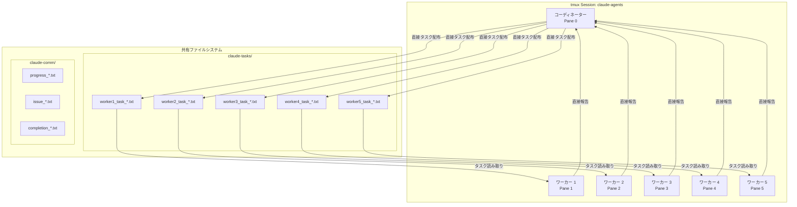
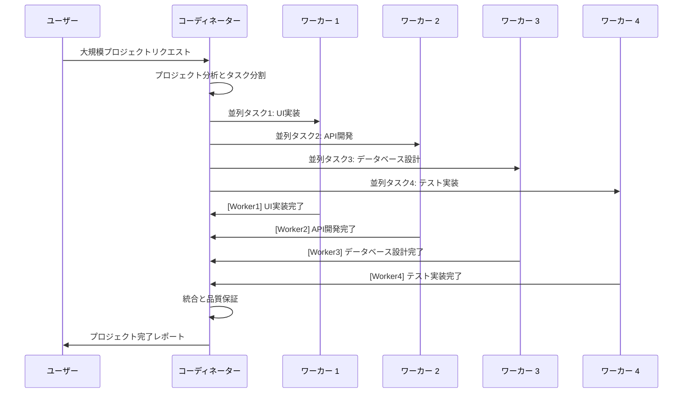

# YouAreTheCEO - マルチエージェントシステム

YouAreTheCEOは、複雑なソフトウェア開発タスクの効率的な並列処理を可能にする、Claude Code用のフラットアーキテクチャマルチエージェント開発システムです。

## 概要

このシステムは、単一のコーディネーターが複数の独立したワーカーを管理する**フラットマルチエージェントアーキテクチャ**を実装しています。この設計により、シンプルさと明確なコミュニケーションパターンを維持しながら、並列処理効率を最大化します。

### 主要機能

- **フラットアーキテクチャ**: 階層の複雑さのないシンプルで直接的なコミュニケーション
- **動的スケーリング**: プロジェクトの複雑さに基づいて最適なチームサイズを自動提案
- **リアルタイムコミュニケーション**: tmuxベースのエージェント間インスタントメッセージング
- **トークン管理**: インテリジェントなコンテキストクリアと使用量監視
- **プロジェクト非依存**: 任意のソフトウェアプロジェクトに設定可能

## クイックスタート

### 1. セットアップ

```bash
# プロジェクトディレクトリに移動
cd /path/to/your/project

# 初期セットアップ（コーディネーターのみ）
./multi-agent/scripts/smart-setup.sh

# すべてのClaude Codeインスタンスを開始
./multi-agent/scripts/start-all-claude.sh

# tmuxセッションに接続
tmux attach -t claude-agents
```

### 2. 基本的なワークフロー

```bash
# コーディネーターがタスクを分析し、必要に応じてワーカーを追加
./multi-agent/scripts/add-workers.sh 4

# ワーカーにタスクを割り当て
./multi-agent/scripts/assign-task.sh 1 "ユーザー認証APIの実装"
./multi-agent/scripts/assign-task.sh 2 "ログインUIコンポーネントの作成"

# 進捗を監視
./multi-agent/scripts/check-status.sh

# 結果を収集
./multi-agent/scripts/collect-results.sh --output project_results.md
```

## モデル設定

システムは、役割に最適化された異なるClaudeモデルを使用します：

- **コーディネーター**: Claude 4 Opus（戦略的思考、アーキテクチャの決定、統合）
- **ワーカー**: Claude 4 Sonnet（実装、コーディング、実行）

この設定により、戦略的監督と効率的な実行のバランスを取ります。

## ディレクトリ構造

```
PROJECT_DIR/                    ← プロジェクトルート（設定可能）
├── your-project-files/         ← 実際のプロジェクトコード
├── multi-agent/                ← マルチエージェントシステム
│   ├── scripts/               ← 実行スクリプト
│   │   ├── smart-setup.sh     ← 初期セットアップ
│   │   ├── start-all-claude.sh ← Claudeインスタンス開始
│   │   ├── add-workers.sh     ← ワーカーエージェント追加
│   │   ├── assign-task.sh     ← タスク配布
│   │   ├── check-status.sh    ← 進捗監視
│   │   └── collect-results.sh ← 結果集約
│   ├── claude-tasks/          ← タスクファイル（自動生成）
│   │   ├── worker1_task_*.txt
│   │   ├── worker2_task_*.txt
│   │   └── ...
│   ├── claude-comm/           ← コミュニケーションファイル（自動生成）
│   │   ├── progress_*.txt
│   │   ├── issue_*.txt
│   │   └── completion_*.txt
│   ├── claude-coordinator.md  ← コーディネーター指示書
│   ├── claude-worker.md       ← ワーカー指示書
│   └── .pane_ids             ← tmuxペーン追跡
```

## 使用ワークフロー

### フェーズ1: プロジェクト分析

1. **ユーザーリクエスト**: 高レベルのプロジェクト要件を提供
2. **コーディネーター分析**: 技術的複雑さと要件を分析
3. **チームサイジング**: 必要なワーカーの最適数を決定

### フェーズ2: 動的チーム編成

```bash
# コーディネーターが複雑さに基づいて決定
./multi-agent/scripts/add-workers.sh [数]
```

**複雑さのガイドライン:**
- **小規模（2ワーカー）**: 単一機能、バグ修正、シンプルなタスク
- **中規模（4ワーカー）**: 複数機能、API開発、UI更新
- **大規模（6ワーカー）**: アーキテクチャ変更、システム統合
- **特大規模（10ワーカー）**: 完全システム再設計、大規模移行

### フェーズ3: 並列実行

1. **タスク配布**: コーディネーターが作業を独立タスクに分割
2. **並列処理**: ワーカーが同時にタスクを実行
3. **リアルタイム報告**: ワーカーが直接コーディネーターに進捗報告
4. **動的調整**: 必要に応じてワーカーを追加/削除

### フェーズ4: 統合

1. **結果収集**: コーディネーターがすべての成果物を収集
2. **品質保証**: 統一されたテストと検証
3. **最終統合**: すべてのコンポーネントを統合されたソリューションにマージ

## コミュニケーションパターン

### ワーカーからコーディネーターへの報告

すべてのワーカーは報告に以下の標準形式を使用します：

```bash
tmux send-keys -t $COORDINATOR_PANE '[WorkerID] Status: Description' Enter
```

**例:**
```bash
# 成功
'[Worker1] Completed: API実装完了'

# 進捗
'[Worker2] Progress: 75%完了 - UIコンポーネント準備完了'

# 問題
'[Worker3] Issue: データベース接続エラー - 支援が必要'

# 質問
'[Worker4] Question: TypeScript strictモードを使用すべきですか？'
```

### コーディネーター指示

コーディネーターは明確で実行可能な指示を提供します：
```bash
# タスク割り当て
"Worker1: JWTトークンとパスワードハッシュ化を使用したユーザー認証を実装"

# エラー処理
"Worker2: データベースエラーが発生した場合は、詳細とともに即座に報告"

# 協力
"Worker3: フロントエンド統合のためにAPIスキーマをWorker4と共有"
```

## System Architecture

### フラットマルチエージェント構造



### コミュニケーションフロー



## ベストプラクティス

### コーディネーター向け

1. **控えめなスタート**: 少ないワーカーから始め、必要に応じてスケールアップ
2. **明確な指示**: 具体的で実行可能なタスクを提供
3. **定期チェック**: 進捗を頻繁に監視
4. **独立タスク**: ワーカー間の依存関係を最小化
5. **品質ゲート**: 統合のためのチェックポイントを実装

### ワーカー向け

1. **直接報告**: コミュニケーションには必ず[WorkerID]を含める
2. **即座問題報告**: ブロッカーが発生したら即座に報告
3. **自己完結型作業**: 割り当てられたタスクを独立して完了
4. **品質保証**: 完了報告前に作業をテスト
5. **協力**: 必要に応じて他のワーカーと関連情報を共有

### トークン管理

1. **事前クリア**: トークン限界に達する前に`/clear`を使用
2. **並列クリア**: 必要に応じてすべてのエージェントを同時にクリア
3. **使用量監視**: 定期的な`ccusage`チェック
4. **戦略的タイミング**: 主要タスク完了後にクリア

```bash
# すべてのエージェントを同時にクリア
./multi-agent/scripts/parallel-clear.sh

# トークン使用量監視
ccusage
```

## 高度な機能

### 動的スケーリング

```bash
# 最小限有効チームで開始
./multi-agent/scripts/smart-setup.sh

# 複雑さに基づいてスケールアップ
./multi-agent/scripts/add-workers.sh 3

# 必要に応じてスケールダウン（手動ペーン管理）
tmux kill-pane -t claude-agents:$PANE_ID
```

### 専門化役割

ワーカーに専門化役割を割り当てることができます：

```bash
# フロントエンドスペシャリスト
"Worker1: ReactコンポーネントとUI/UX実装に集中"

# バックエンドスペシャリスト
"Worker2: APIエンドポイントとデータベース操作を担当"

# DevOpsスペシャリスト
"Worker3: デプロイメントとインフラ関連を管理"

# テストスペシャリスト
"Worker4: 包括的なテストカバレッジを実装"
```

### ワーカー間協力

```bash
# 情報共有
"Worker1: フロントエンド統合のためにAPIスキーマをWorker2と共有"

# レビューとフィードバック
"Worker3: 最適化の機会のためWorker1のデータベース設計をレビュー"

# ペアプログラミング
"Worker2とWorker4: 認証実装で協力"
```

## トラブルシューティング

### 一般的な問題

**権限エラー:**
```bash
chmod +x multi-agent/scripts/*.sh
```

**セッション管理:**
```bash
# セッション一覧
tmux list-sessions

# 終了と再開
tmux kill-session -t claude-agents
./multi-agent/scripts/smart-setup.sh
```

**ペーンIDの問題:**
```bash
# 現在のペーンIDを確認
cat multi-agent/.pane_ids

# 必要に応じて再生成
./multi-agent/scripts/smart-setup.sh
```

### パフォーマンス最適化

1. **並列独立性**: タスクが独立して実行できることを確認
2. **リソース監視**: 重い並列処理中のシステムリソースを監視
3. **コミュニケーション効率**: 簡潔で明確なメッセージを使用
4. **戦略的統合**: 問題を早期に発見するため頻繁に統合

### エラー回復

1. **即座報告**: ワーカーはエラーを即座に報告
2. **コンテキスト保存**: デバッグのためエラーコンテキストを維持
3. **タスク再配分**: ワーカーがブロックされた場合のタスク再配分
4. **漸進的回復**: 全体再開ではなく漸進的に問題を修正

## 設定

### プロジェクト固有セットアップ

プロジェクト用にスクリプトを編集して設定します：

```bash
# smart-setup.sh内
PROJECT_DIR="/path/to/your/project"  # このパスを変更
SESSION_NAME="your-project-agents"   # セッション名を変更

# start-all-claude.sh内
CLAUDE_CMD="claude-code"             # 必要に応じてClaude Codeコマンドを調整
```

### モデル選択

```bash
# コーディネーターモデル（戦略的思考）
COORDINATOR_MODEL="claude-4-opus"

# ワーカーモデル（効率的実行）
WORKER_MODEL="claude-4-sonnet"
```

## パフォーマンス指標

### 効率指標

- **並列処理率**: 同時に完了したタスク数
- **コミュニケーションオーバーヘッド**: 実行対調整に費やした時間
- **統合成功率**: 並列作業の成功マージ率
- **エラー回復時間**: エラー検出から解決までの時間

### 最適化目標

- **並列性の最大化**: 80%以上の独立タスク実行を目指す
- **調整の最小化**: コミュニケーションを簡潔で目的あるものに保つ
- **高速統合**: 競合の迅速な特定と解決
- **品質維持**: すべてのワーカーで一貫したコード品質

## 貢献

このシステムはプロジェクト非依存で拡張可能に設計されています。改良の主要領域：

1. **スクリプト改善**: より適切なエラー処理、より多くの自動化
2. **コミュニケーションパターン**: 拡張されたメッセージングプロトコル
3. **統合ツール**: より適切なマージと競合解決
4. **監視**: マルチエージェントステータスのリアルタイムダッシュボード
5. **テンプレートシステム**: 一般的なプロジェクトタイプ用の事前設定セットアップ

## アーキテクチャの利点

### フラット構造の利点

1. **シンプルさ**: 理解しやすく管理しやすい
2. **最大並列性**: 階層的ボトルネックがない
3. **直接コミュニケーション**: 問題から解決までの最短経路
4. **スケーラビリティ**: ワーカーの追加/削除が容易
5. **統一品質**: 単一統合ポイントが一貫性を保証

### 階層システムとの比較

- **より高速な意思決定**: 複数の管理層がない
- **複雑さの減少**: すべての参加者にとってよりシンプルなメンタルモデル
- **より適切なリソース利用**: すべてのワーカーが同時に生産性を発揮
- **より容易なデバッグ**: 問題解決のための明確なコミュニケーション経路

このマルチエージェントシステムは、複雑なソフトウェア開発プロジェクトを効率的に並列化されたワークフローに変換し、高品質基準を維持しながら開発時間を劇的に短縮します。